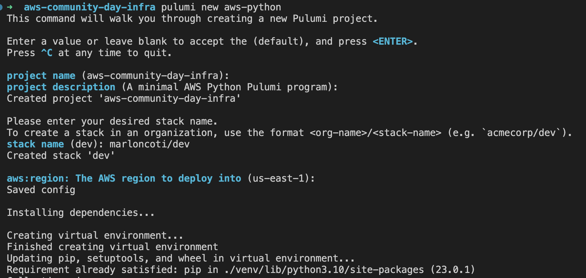

# Aws community day GT  Demo step by step Guide

## 1 Infrastructure Definition

### 1.1 Install Pulumi CLI  and install your choose Language runtime

    Follow the oficial documentation to install pulumi.  
    https://www.pulumi.com/docs/clouds/aws/get-started/begin/

### 1.2. Configure your backend state 
if you want to sue pulumi service as your backend state, then  create an free account and using the pulumi cli to login and set the pulumi token.

```bash
    pulumi login
```

### 1.3. Create your IAC Project
After login, create a new iac pulumi project (in this workshop we'll use Python as our iac language)

```bash
    # create the project directory
    mkdir aws-community-day-infra 

    cd aws-community-day-infra

    # start a new pulumi project with python
    pulumi new aws-python
```
you will be asked for a project name and project description. Hit ENTER to accept the default values or specify new values.



Next, you will be asked for a stack name. Hit ENTER to accept the default value of dev.

Finally, you will be prompted for some configuration values for the stack. For AWS projects, you will be prompted for the AWS region. You can accept the default value or choose another value like us-east-1.

After the command completes, the project and stack will be ready.
Next, we’ll review the generated project files.

### 1.4 Define some Resources to be deployed

Edit the `main.py` file, this is the Pulumi program that defines your stack resources.

```python

"""An AWS Python Pulumi program for aws community day gt"""
import pulumi
import pulumi_aws as aws
import pulumi_awsx as awsx  
from  pulumi_aws.ec2 import  _enums


#constats
project_name = 'community-day-gt'

# config 
config = pulumi.Config('aws-community-day-infra')

mandatory_tags= {
    'const-center': project_name,
    'stack': 'demo-stack',
    'owner': 'frontend-team'
}

# create vpc
vpc =  awsx.ec2.Vpc(
    resource_name= f'{project_name}-vpc',
    number_of_availability_zones=1,
    cidr_block='10.0.0.0/16',
    subnet_specs= [
        awsx.ec2.SubnetSpecArgs(
            type=awsx.ec2.SubnetType.PUBLIC,
            cidr_mask=20,
            name='community-day-public-subnet'
        ),
        awsx.ec2.SubnetSpecArgs(
            type=awsx.ec2.SubnetType.PRIVATE,
            cidr_mask=20,
            name='community-day-private-subnet'
        )
    ],
    tags= {
        'Name': f'{project_name}-vpc'
    }
    #tags = dict(mandatory_tags, Name = f'{project_name}-security-group')

)

## create a security group
web_security_group = aws.ec2.SecurityGroup(
    resource_name=f'{project_name}-security-group',
    vpc_id= vpc.vpc_id,
    name=f'{project_name}-security-group',
    ingress= [
        aws.ec2.SecurityGroupIngressArgs(
            protocol= "tcp", from_port=80, to_port= 80,  cidr_blocks=['0.0.0.0/0']
        ),
        aws.ec2.SecurityGroupIngressArgs(
            protocol= "tcp", from_port=22, to_port= 22,  cidr_blocks=['0.0.0.0/0']
        )
    ],
    tags= {
        'Name': f'{project_name}-security-group'
    }
    # tags = dict(mandatory_tags, Name = f'{project_name}-security-group')
)

## create instances
instance_count = config.get_int('instanceCount')
ami = config.get('ami')
ssh_key =  config.get('ssh_key')

for index in range(instance_count):
    resource_name = f'{project_name}-instance-${index + 1}'
    
    instance = aws.ec2.Instance(
        resource_name=resource_name,
        instance_type = "t2.micro",
        associate_public_ip_address= True,
        ami= ami,
        subnet_id= vpc.public_subnet_ids[0],
        vpc_security_group_ids= [web_security_group.id],
        user_data="""#!/bin/bash
        echo "Hello, World!" > index.html
        nohup busybox httpd -f -p 80 &
        """,
        tags={
            'Name': resource_name
        }
        # tags = dict(mandatory_tags, Name = resource_name)
    )
 

```

### 1.5 create a policy pack project 
Create a directory for your new Policy Pack, and change into it.

For this Demo we are using Typescript as base language code to define our Policypack

```bash
mkdir aws-community-day-policypack && cd aws-community-day-policypack
```

Run the pulumi policy new command.

```bash
pulumi policy new aws-typescript
```

Tweak the Policy Pack in the index.ts file as desired. The existing policy in the template (which is annotated below) mandates that an AWS S3 bucket not have public read or write permissions enabled.

```ts
import * as aws from "@pulumi/aws";
import { PolicyPack, ReportViolation, validateResourceOfType } from "@pulumi/policy";

const mandatoryTags = ['Name', 'cost-center', 'owner', 'stack']

new PolicyPack("aws-typescript", {
    policies: [
        {
            name: "discouraged-ec2-public-ip-address",
            description: "Associating public IP addresses is discouraged.",
            enforcementLevel: "advisory",
            validateResource: validateResourceOfType(aws.ec2.Instance, (instance, args, reportViolation) => {
                if (instance.associatePublicIpAddress) {
                    reportViolation("Consider not setting associatePublicIpAddress to true.");
                }
            }),
        },
        {
            name: "required-mandatory-tags",
            description: `Mandatory Tags are required [ ${mandatoryTags} ]`,
            enforcementLevel: "mandatory",
            validateResource: [

                validateResourceOfType(aws.ec2.Instance, (instance, args, reportViolation) => {
                    requiredTags(instance.tags, reportViolation);
                }),
                
                validateResourceOfType(aws.ec2.Vpc, (vpc, args, reportViolation) => {
                    requiredTags(vpc.tags, reportViolation);
                }),
            ],
        },
        {
            name: "prohibited-public-internet",
            description: "Ingress rules with public internet access are prohibited.",
            enforcementLevel: "mandatory",
            validateResource: validateResourceOfType(aws.ec2.SecurityGroup, (sg, args, reportViolation) => {
                const publicInternetRules = (sg.ingress || []).find(ingressRule =>
                    (ingressRule.cidrBlocks || []).find(cidr => cidr === "0.0.0.0/0"));
                if (publicInternetRules) {
                    reportViolation("Ingress rules with public internet access are prohibited.");
                }
            }),
        }
    ],
});


function requiredTags(tags: any, reportViolation: ReportViolation) {

    mandatoryTags.forEach(tagKey => {
        if ((tags || {})[tagKey] === undefined) {
            reportViolation(`A ${tagKey} tag is missing.`);
        }
    })
}

```


Running Locally

Use the --policy-pack flag with pulumi preview or pulumi up to specify the path to the directory containing your Policy Pack when previewing/updating a Pulumi program.

```bash
    pulumi preview --policy-pack <path-to-policy-pack-directory>
```